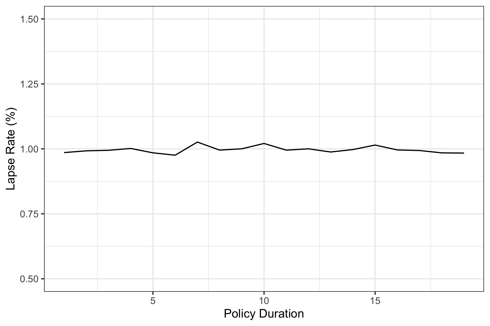
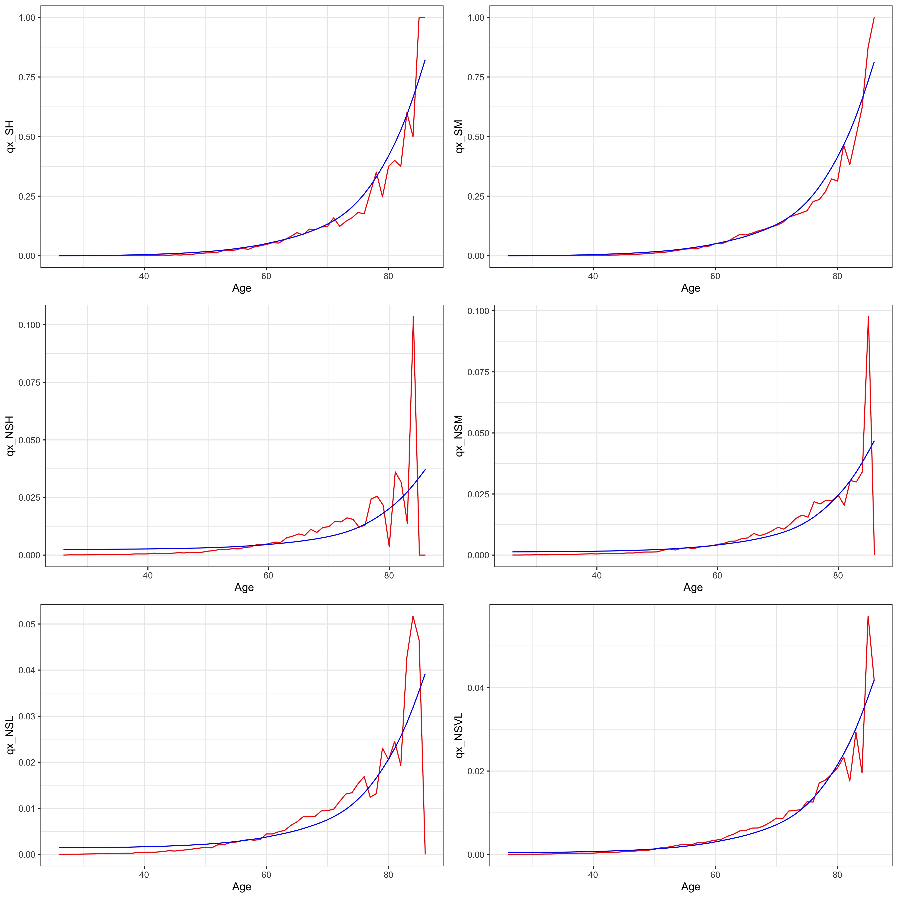
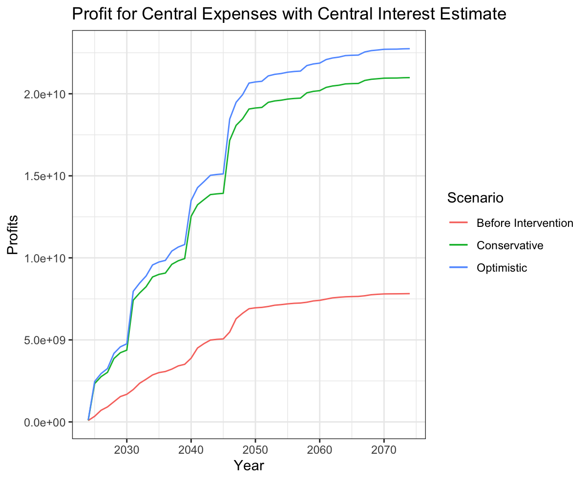
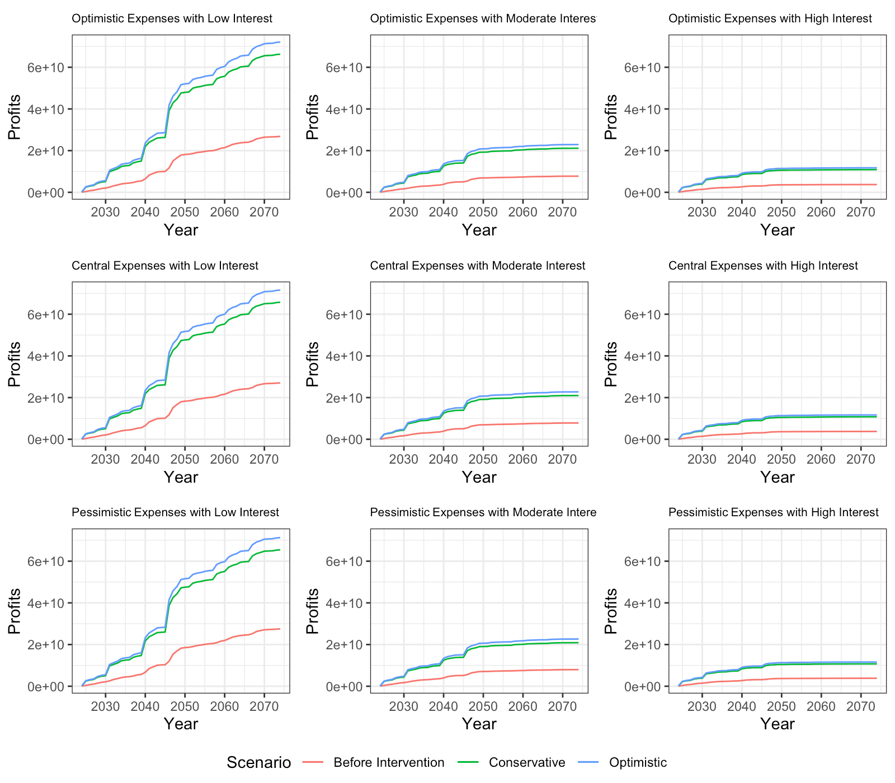
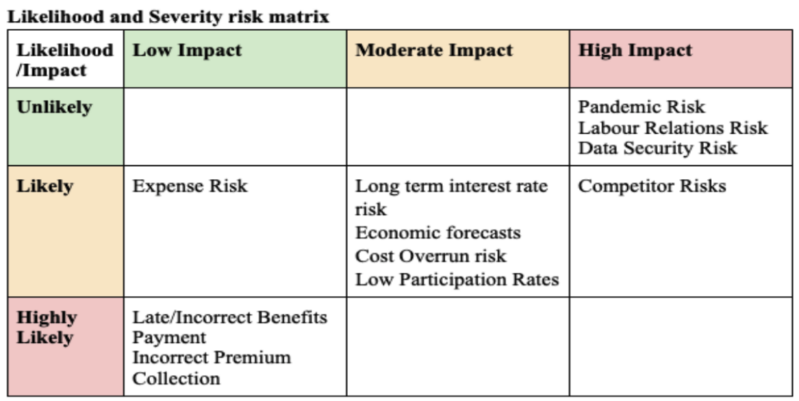

You can view the final report [here](grp_report.pdf).

 Lumaria: Health Care Incentive Program for SuperLife
## 2024 SOA Student Research Case Study
Team GRP: Alexander Gerlyand, Mack Huang, Jayden Ly, Andre Wang, Robert Zheng

## Introduction

GRP has been tasked with improving Lumarian policyholder expected mortality for those who have purchased SuperLife’s whole life and term insurance products through being paired with incentive programs. Lumaria as a country is rich with cultural heritage whilst maintaining modernity. It offers a temperate climate, world renowned natural landmarks. Lumaria’s population has high literacy rates, an 18% smoking rate, and has access to universal healthcare. In this report, GRP aims to take advantage of Lumaria’s unique features in the form of a 3 intervention Health Incentive Program to achieve the objectives below.

### Objectives

The main objectives of the health incentive program are to:
- Incentivise healthy behaviours through participation in the program
- Decrease expected mortality
- Increase life insurance sales
- Improve product marketability and competitiveness
- Add economic value to SuperLife

The key metrics to measure the success of the program are profit, participation rate, impact on mortality (success rate) and surveys to see customer satisfaction. These metrics would be continuously monitored to ensure the Health Incentive Program is on track, and to inform SuperLife of how to adjust program parameters to ensure smooth operation into the future.

## Program Design

Exploratory Data Analysis (EDA) has shown that leading causes of death within SuperLife’s policyholders are cancer and cardiovascular disease. Therefore, the interventions chosen to make up the Health Incentive Program are targeted towards reducing the incidence of these conditions. These programs are:

- a Well-being app with Fitness tracking incentives that aims to provide a convenient platform for policyholders to monitor and enhance their physical and mental well-being
- a Smoking Cessation program that offers a comprehensive platform for policyholders seeking to quit smoking, providing crucial resources and support tailored for individual needs
- a Hiking and Outdoor Activities Group that offers a platform for policyholders to engage in physical activities amidst Lumaria’s Luminous Lake, Skyreach and Whispering Woods. This program’s main objective is to improve policyholders' all round health with particular focus on cardiovascular and mental health

## Exploratory Data Analysis
Lengthy EDA was conducted. Members investigated answers to many questions using the data, such as: 
What current distribution channels have been successful for the company? 
What has the total payout been so far?
Is the mortality of smokers different to non-smokers?
How are urban and rural policyholders distributed between underwriting classes?
Are rural policyholders different in lifespan to urban policyholders?

Scripts used to explore data can be viewed [here](eda).

## Data limitations
### Limited data
There were significantly fewer instances of certain policyholders, which would lead to higher standard error of mortality estimates. 
### Homogeneity 
The lack of discernible patterns within the dataset with respect to underwriting class and regions would complicate the task of identifying and engineering relevant features. 
### Economics data
Inflation, overnight interest and spot rates are provided annually from 1962 to 2023. Limited data would lead to restrictions on the accuracy of projections.
### Multiple States Transition Data
Mortality statistics can be derived for smokers and non smokers from the policy in force data set. However, it doesn’t provide information or have a separate state for ex-smokers. Collecting data on smokers to quit smoking would help better quantify the mortality savings of our smoking cessation program.

## Pricing
### Decrements Modelling
- Lapse rates for each year of the 20 year level term (T20) insurance policy were calculated using the internal policies in-force data set. 
- Using Kaplan Meier’s method, crude estimates of mortality rates were obtained for categories of policy holders based on smoker and underwriting status and were graduated with reference to the 2010 Lumerian Life Table for the general population

  
### Economic rates modelling
- The investment growth rate was assumed to be the risk free 1 year spot rate and the risk discount rate was assumed to be the overnight rate plus a 5% risk loading
- Overnight interest rates and 1 year spot rates were projected for the next 20 years using double exponential smoothing for pricing of T20 policies. Sensitivity testing varied the interest rate within the 30% CI interval of interest rate predictions. 
- For SPWL policies, interest rates were assumed to be constant in the long term and we tested different levels between the historical extremes. 

### Policyholder projections
- Future policies counts were projected by age, underwriting class, face amount, and smoker status.
- After finding that the number of newly issued policies to each underwriting class and smoker status followed a visibly linear trend, simple linear regressions were used on different types of policyholder to predict future counts.
- The linearity assumption was based on linear historical data, and holds intuitive validity as policyholder count would be expected to consist of both population and economic growth.

### Premium pricing
- Profit was calculated on a per-policy basis by first calculating zero-profit net premiums for policies issued in different years to individuals of different smoking status, underwriting class, and age using the equivalence principle.
- Zero-profit premiums were then increased by a loading dependent on the underwriting class to create profitable premiums. The loadings were computed based on the volatility of crude mortality estimates qx using the sum of squares of standardised residuals
- An estimate of initial expense as well as ongoing expenses were based on research on other life insurance companies’ cash flows.
- Premiums were calculated for each issue age band (26-35, 36-45, 46-50, 51-55, 56-65). Issue age bands were chosen so that there was an approximately equal number of observations in each bin. More bins were required towards higher ages due to the steep increase in mortality after age 60, and higher risk groups should be separately charged appropriate premiums to mitigate a possible inequitable access risk. 
- Aggregate profits on the last twenty years were estimated using before and after intervention, using a reduction in mortality after intervention computed on given mortality reduction bounds of 4.94% and 9.76%. The impact of the smoking cessation program was modelled across the entire range of cessation proportions, and mortality of lapsed smokers was estimated as the average of smokers and nonsmokers according to our assumption. Initial expenses were increased with the introduction of interventions based on given costs and research (Program). Smoker policies incurred expenses associated with the smoking cessation program.
- The aggregate profit was calculated by holding the premium constant with reduced mortalities and higher expenses across the current count of policyholders.
- Aggregate future profits were again calculated by considering the reduction in mortality and the increase in expense. Below is our central estimate for future profits with and without the interventions.

## Sensitivity Analysis
- Due to a lack of understanding of SuperLife’s expense structure, and external impacts listed in the Risk and Risk Mitigation Considerations section, a set of three estimates of expenses were used to calculate profits of SuperLife, representing the optimistic, pessimistic, and central estimates.
- The impact of each intervention on mortality had a degree of uncertainty and thus the upper and lower bounds of the impact were considered.
- Due to reinvestment risk, three scenarios of interest rates were also used.
- In mitigating model risk with regards to predictions on customer growth, lower and upper confidence bounds of 95% were further considered.
- A range of estimated change in profits were calculated on intervention impacts if the intervention were introduced twenty years ago, with a figure of 15% increase in profit assuming the pessimistic expenses scenario. 

- The projections highlight that the intervention should outperform sales without the intervention.
- In the most pessimistic scenario, the expected cumulative profits in 2028, 2033 and 2043 are 203.97%, 208.03%, and 170.64% more than the corresponding profit without intervention in that scenario.
- In the most optimistic scenario, the expected cumulative profits in 2028, 2033 and 2043 are 247.25%, 248.47%, and 206.95% more than the corresponding profit without intervention in that scenario.
- An unfavourable scenario we investigated was the exclusive underwriting of 20 year term policies to 35 year old smokers with a zero cessation rate, in which we observed an annual drop in profits of 9.16% due to the largely increased expenses.

## Assumptions
| Assumption 	| Rationale and Analysis 	|
|---	|---	|
| Conservative investment growth rate 	| Conservative investment growth rate assumed to be equal to the risk-free 1 year spot rate. 	|
| Prevalent decrements for T20 and SPWL 	| Assume that the only decrements for term policies are withdrawal and deaths. For single premium policies, only decrement is death. 	|
| Lapse rates 	| Lapse rates are constant for the duration of the policy. This was supported by our lapse rates estimates from the in force dataset.  	|
| Mortality curves of Lumarians 	| The shape of the mortality curves of Superlife’s insured policyholders should follow that of the general population in 2010 provided by Superlife. Assume the mortality curves of different subsets of insured policy holders can be obtained by a  linear transformation of the provided mortality curve.  	|
| Commissions and expenses 	| Payment of commissions and expenses over time could be appropriately based on figures from existing insurance companies. 	|
| Independence of intervention effect 	| The impacts of each intervention program were independent of each other, to ease calculations. Their impact was also assumed to be the same per policyholder, despite the possibility that specific individuals would benefit more from the intervention. 	|
| The mortality of lapsed smokers 	| The mortality of lapsed smokers lies between the mortality of smokers and nonsmokers.  	|
| Exchange to USD 	| Assume the exchange rate from Lumarian Crowns to USD is pegged at a single rate. All calculations were made in USD at this pegged exchange rate. 	|
| Participation rate 	| The participation rate is a function of benefits provided by the intervention. 	|
| Youngest Age 	| The youngest age of a person purchasing insurance was 26. 	|

## Risk and Risk Mitigation Considerations

| Qualitative Risk                                                   | Mitigation  |
|--------------------------------------------------------|----------------------------------------------------------------------------------------------------|
| Reinvestment risk related to investments into fixed income securities which are susceptible to interest rate fluctuations 	| Test the effects of adverse interest fluctuations on discounted profits. Hedge against decreasing long-term interest rates by buying interest rate options
| Economic forecasts risk 	| Future forecasted rates of inflation and interest rates do not reflect true movements in variables impacting accuracy of the model
| Expense risk relating to maintenance of incentives programs 	| Conducting cost-benefit analysis to evaluate effectiveness of different incentives programs, cost-plus process to ensure profits are maintained
| Cost overrun risk where project costs deviate from actual experience 	| Establish contingency funds to address unexpected program costs and fluctuations in expenses.
| Low participation rates in incentive programs - expected mortality and economics benefits will not be realised 	| Implement increased targeted market campaigns focusing on the distribution channels and educational initiatives to promote program awareness and encourage participation among policyholders.
| Pandemic Risk: a pandemic may present an adverse change to the mortality of Lumarians 	| Sensitivity testing for extreme increases in mortality rate caused by pandemic

| Qualitative Risk                                                   | Mitigation  |
|--------------------------------------------------------|----------------------------------------------------------------------------------------------------|
| Regulatory changes | Compliance monitoring to stay informed about regulatory changes and ensure compliance with laws and regulations.
| Negative Public Perception risk: If the program is perceived as exploiting users for their personal data or promoting unattainable body image standards.| Being transparent about privacy policies and data usage. Emphasis on the program being to promote healthier lifestyles rather than a focus on physical appearance. 
| Inequitable access risk: Socioeconomic factors may affect accessibility of programs to certain subsections of the population. | Implementing outreach programs and potential subsidies to make programs more accessible for everybody. Apps would have better UI and UX to accommodate for people who are less technologically literate.

## Conclusion and Recommendations
The potential for SuperLife’s growth and development in Lumaria’s health through our proposed Well-being app, smoking cessation and hiking groups is significant. By investing in these proactive measures, SuperLife stands to realise reduced healthcare costs, fewer insurance claims, and enhanced customer satisfaction, creating shared value within Lumaria. 

To increase the likelihood of success in the future, regular maintenance must be implemented on the program design. Constant monitoring of key metrics of profit, policyholder mortality, customer satisfaction and participation rates will allow SuperLife to complete the actuarial control cycle, continually adjusting project parameters to cater for the ever-changing economic and consumer environment in which the company operates.

